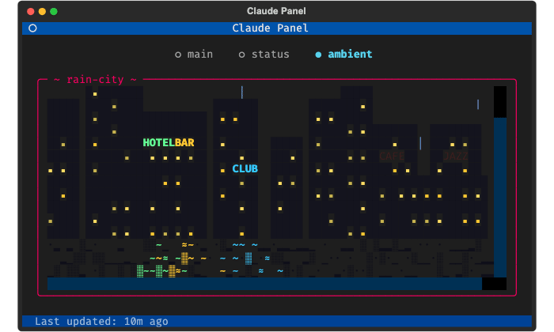
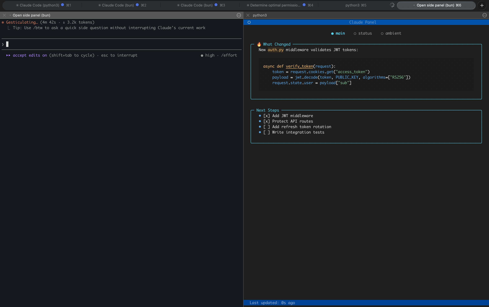
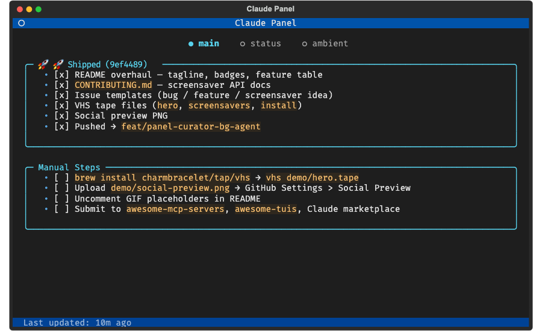
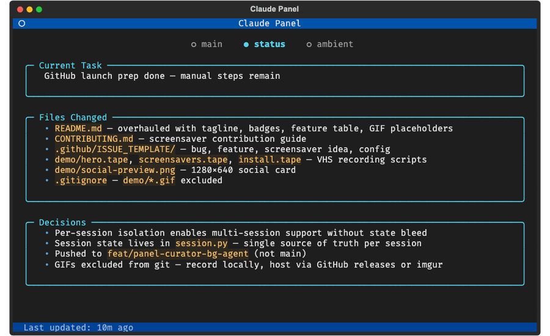

<p align="center">
  <h1 align="center">Claude Panel</h1>
  <p align="center">
    A side panel where Claude shows you what it's thinking — plus ambient screensavers
  </p>
</p>

<p align="center">
  <a href="https://www.python.org/downloads/"></a>
  <a href="https://github.com/alex-radaev/claude-panel/blob/main/LICENSE"></a>
  <a href="https://github.com/alex-radaev/claude-panel/stargazers"></a>
</p>



**Claude Panel** is a persistent TUI that sits next to your Claude Code terminal.

Claude decides what to show on the panel — summaries, explanations, code highlights, progress checklists, architecture diagrams, or just a mood emoji. It's a second communication channel that doesn't add noise to the conversation.

- **Main screen** — Claude's canvas. Whatever it thinks is useful right now.
- **Status screen** — auto-updating dashboard: current task, files changed, decisions.
- **Ambient screen** — your choice of terminal screensaver.

Two screens managed by Claude. One screen managed by you.

<br clear="right"/>

---

<p align="center"></p>
<p align="center"><em>Claude Code on the left, Panel with rain-city screensaver on the right</em></p>

## How It Works

Claude Code is great, but the conversation scrolls fast. What was the last decision? Which files changed? What's Claude working on right now?

Claude Panel answers all of that **automatically**. No manual commands needed:

1. **After every response**, a lightweight AI curator (Haiku) reads the conversation and updates the **status screen** — current task, files touched, decisions made.
2. **Claude spawns background agents** that update the **main screen** with whatever content is worth pinning — code snippets, diagrams, mood, next steps. Zero conversation noise.
3. **The viewer polls** the state file every 300ms and re-renders instantly.

### Main Screen — Claude's Canvas



Claude uses this screen to show you whatever is most relevant:

- Working on auth? The key function signature and a fire emoji
- Debugging? The error message and current hypothesis
- Multi-step task? A progress checklist with checked items
- Just chatting? A mood emoji that matches the vibe

Claude has full creative control. It picks the content, the format, and when to update.

<br clear="right"/>

### Status Screen — Structured Dashboard



Three fields, auto-updated after every Claude response:

- **Current Task** — what Claude is working on right now
- **Files Changed** — which files were touched and why
- **Decisions** — non-obvious choices made and the reasoning

This runs via a Stop hook + Haiku LLM. Zero effort from you.

<br clear="right"/>

### Ambient Screen — Your Screensaver

Eight built-in terminal animations. Navigate with arrow keys or `panel(show="ambient")`.

`rain-city` | `tokyo-drift` | `city-lights` | `matrix` | `noir` | `banquet` | `dvd-bounce` | `space-flight`

Screensavers are plain Python scripts that draw to a Rich canvas. [Creating your own takes ~10 lines.](CONTRIBUTING.md#creating-a-screensaver)

## Install

```bash
# As a Claude Code plugin (recommended)
claude plugin install claude-panel@claude-panel
```

<details>
<summary>Manual installation</summary>

```bash
git clone https://github.com/alex-radaev/claude-panel
cd claude-panel
uv sync
```

Then add to your MCP config (`~/.claude/settings.json` or `.mcp.json`).

</details>

## Usage

The panel opens in an iTerm2 split pane. Ask Claude to open it, or:

```bash
# From Claude Code
panel_open()

# Manual
uv run claude-panel
```

Once running, Claude takes over. The main and status screens update on their own. You can switch views:

```python
panel(show="ambient")              # switch to screensaver
panel(show="main")                 # switch to main canvas
panel(show="status")               # switch to status dashboard
panel(screensaver="tokyo-drift")   # change screensaver
```

| Key | Action |
|-----|--------|
| `q` | Quit viewer |
| `<-` `->` | Cycle screens |
| `c` | Clear panel |

## Architecture

```
 Claude Code session              iTerm2 Split Pane
┌──────────────────────┐         ┌──────────────────┐
│                      │         │                  │
│  Main Claude         │         │  Textual TUI     │
│  + Background agents │         │  Viewer          │
│  + Stop hook curator │         │                  │
│                      │         │                  │
└──────────┬───────────┘         └────────┬─────────┘
           │  WRITES                      │ POLLS
           └──────►  per-session   ◄──────┘
                     state.json
            ~/.claude-panel/sessions/<id>/
```

**Session isolation:** Each Claude Code session gets its own state. Run multiple sessions — they don't interfere. The viewer tracks whichever session is active.

## Configuration

`~/.claude-panel/config.json`:

```json
{
  "model": "claude-haiku-4-5-20251001",
  "favorite_screensaver": "tokyo-drift",
  "update_every_n": 1
}
```

## Contributing

Contributions welcome — especially new screensavers. See [CONTRIBUTING.md](CONTRIBUTING.md) for the full guide, including a screensaver template that gets you started in ~10 lines of Python.

## License

MIT
