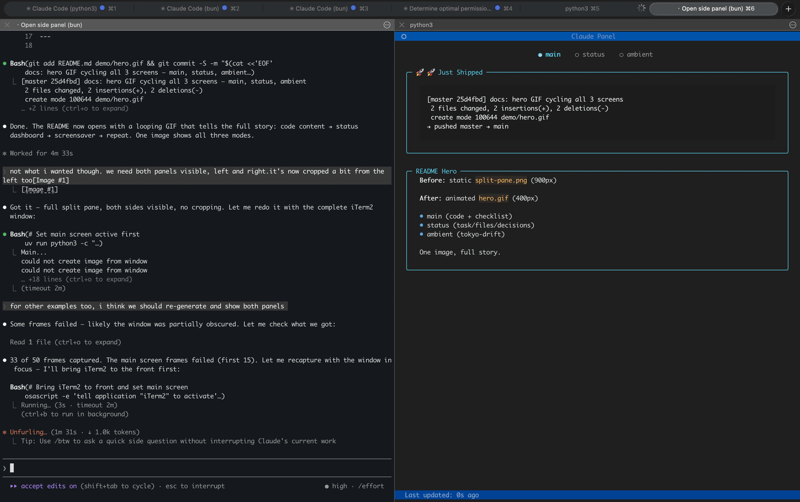
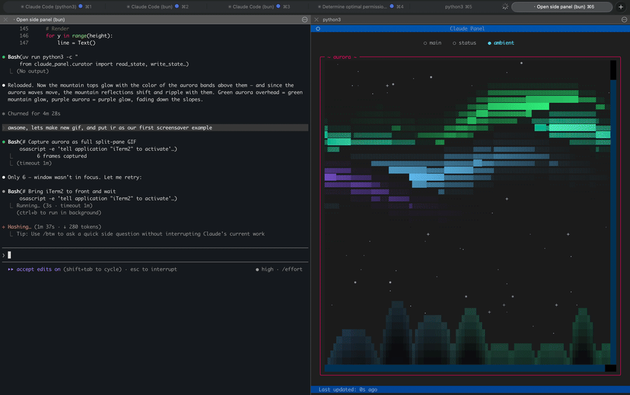
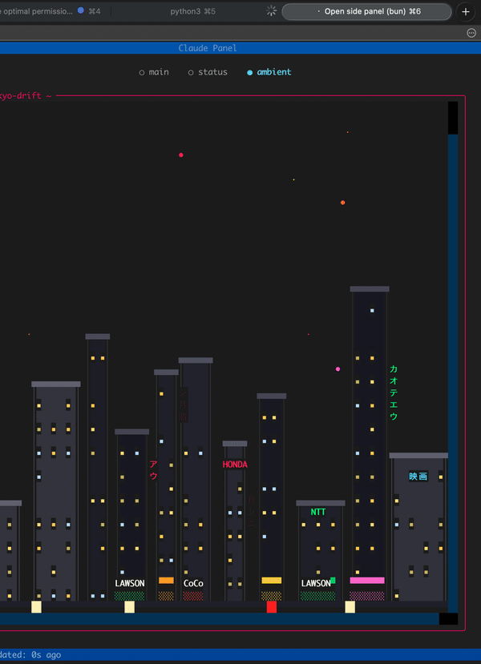

<p align="center">
  <h1 align="center">Claude Panel</h1>
  <p align="center">
    Claude Code gets its own screen — it decides what you need to see
  </p>
</p>

<p align="center">
  <a href="https://www.python.org/downloads/"></a>
  <a href="https://github.com/alex-radaev/claude-panel/blob/main/LICENSE"></a>
  <a href="https://github.com/alex-radaev/claude-panel/stargazers"></a>
</p>

<p align="center"></p>
<p align="center"><em>Main screen (Claude's content) → Status dashboard → Ambient screensaver</em></p>

---

Claude Panel is a persistent TUI that sits next to your Claude Code terminal. Claude autonomously updates the panel with whatever it thinks matters — code it just wrote, a diagram, next steps, or a mood emoji. A structured dashboard tracks the current task, files changed, and key decisions, refreshing after every response. And when you're between tasks, ambient terminal screensavers keep the vibe going.

## Three Screens

| Screen | Managed by | What it shows |
|--------|-----------|---------------|
| **Main** | **Claude** | Whatever Claude thinks is useful right now — code snippets, explanations, diagrams, progress checklists, mood emoji. Full creative control. |
| **Status** | **Claude** (AI curator) | Structured dashboard: current task, files changed, decisions made. Auto-updates after every response. |
| **Ambient** | **You** | Terminal screensaver of your choice. Plays when nothing else needs your attention. |

**Claude manages the content, you manage the screensaver.** The main and status screens update automatically — Claude reads the conversation, decides what's worth pinning on screen, and writes it. No manual commands needed.

## Ambient Screensavers

Twelve built-in terminal animations ship with the package. Navigate with arrow keys or `panel(show="ambient")`.

<p align="center"></p>
<p align="center"><em>aurora</em></p>

<p align="center"></p>
<p align="center"><em>tokyo-drift</em></p>

Also available: `neon-dreams` | `neon-street` | `space-flight` | `rain-city` | `city-lights` | `matrix` | `noir` | `banquet` | `dvd-bounce` | `synthwave`

All screensavers are bundled with the package — they work out of the box on a fresh install.

### Custom screensavers

Drop a `.py` file in `~/.claude-panel/screensavers/` and it becomes available immediately. User screensavers override bundled ones of the same name, so you can customize any built-in screensaver without touching the package.

```bash
# List available screensavers
panel(screensaver="rain-city")

# Or ask Claude to create one
# "make me a screensaver with falling snow"
```

Screensavers are plain Python scripts that draw to a Rich canvas. [Creating your own takes ~10 lines.](CONTRIBUTING.md#creating-a-screensaver)

## Install

```bash
# As a Claude Code plugin (recommended)
claude plugin install claude-panel@claude-panel
```

<details>
<summary>Manual installation</summary>

```bash
git clone https://github.com/alex-radaev/claude-panel
cd claude-panel
uv sync
```

Then add to your MCP config (`~/.claude/settings.json` or `.mcp.json`).

</details>

## Usage

The panel opens in an iTerm2 split pane. Ask Claude to open it, or:

```bash
# From Claude Code
panel_open()

# Manual
uv run claude-panel
```

Once running, Claude takes over. The main and status screens update on their own. You can switch views:

```python
panel(show="ambient")              # switch to screensaver
panel(show="main")                 # switch to main canvas
panel(show="status")               # switch to status dashboard
panel(screensaver="tokyo-drift")   # change screensaver
```

| Key | Action |
|-----|--------|
| `q` | Quit viewer |
| `<-` `->` | Cycle screens |
| `c` | Clear panel |

> **iTerm2 tip:** The panel pane may look washed out because iTerm2 dims inactive split panes by default. To fix: **Settings > Appearance > Dimming** and uncheck **Dim inactive split panes**.

## How It Works

```
 Claude Code session              iTerm2 Split Pane
┌──────────────────────┐         ┌──────────────────┐
│                      │         │                  │
│  Main Claude         │         │  Textual TUI     │
│  + Background agents │         │  Viewer          │
│  + Stop hook curator │         │                  │
│                      │         │                  │
└──────────┬───────────┘         └────────┬─────────┘
           │  WRITES                      │ POLLS
           └──────►  per-session   ◄──────┘
                     state.json
            ~/.claude-panel/sessions/<id>/
```

1. **Claude responds** — a Stop hook runs the AI curator (Haiku). It reads the conversation, decides what changed, and updates the **status screen**.
2. **Claude spawns a background agent** — updates the **main screen** with whatever content is worth showing. Zero conversation noise.
3. **The viewer polls** the state file every 300ms and re-renders instantly.

**Session isolation:** Each Claude Code session gets its own state. Run multiple sessions — they don't interfere. The viewer tracks whichever session is active.

## Configuration

`~/.claude-panel/config.json`:

```json
{
  "model": "claude-haiku-4-5-20251001",
  "favorite_screensaver": "tokyo-drift",
  "update_every_n": 1,
  "curator_personality": "playful"
}
```

| Option | Values | Description |
|--------|--------|-------------|
| `model` | Any Claude model ID | Model for the status curator (default: Haiku) |
| `favorite_screensaver` | Screensaver name | Default ambient screensaver |
| `update_every_n` | Number | Update status every N responses (1 = every time) |
| `curator_personality` | `"playful"`, `"professional"` | Curator tone — playful adds humor and emoji combos, professional is concise and factual |

## Contributing

Contributions welcome — especially new screensavers. See [CONTRIBUTING.md](CONTRIBUTING.md) for the full guide, including a screensaver template that gets you started in ~10 lines of Python.

## License

MIT
